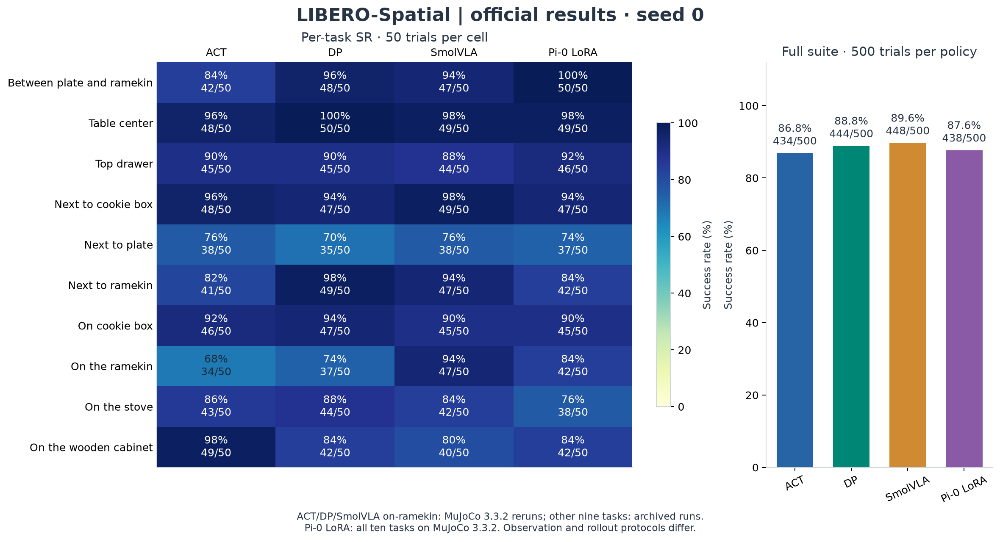
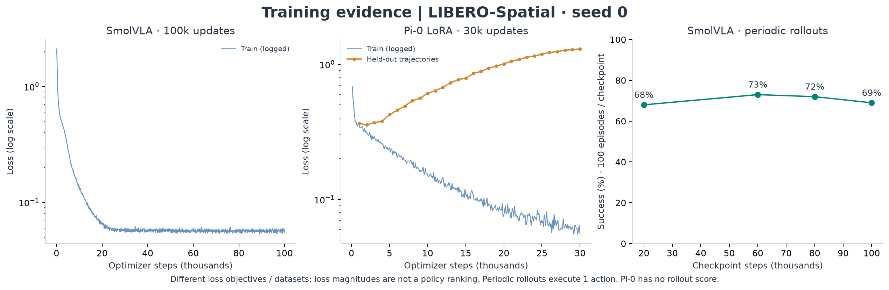
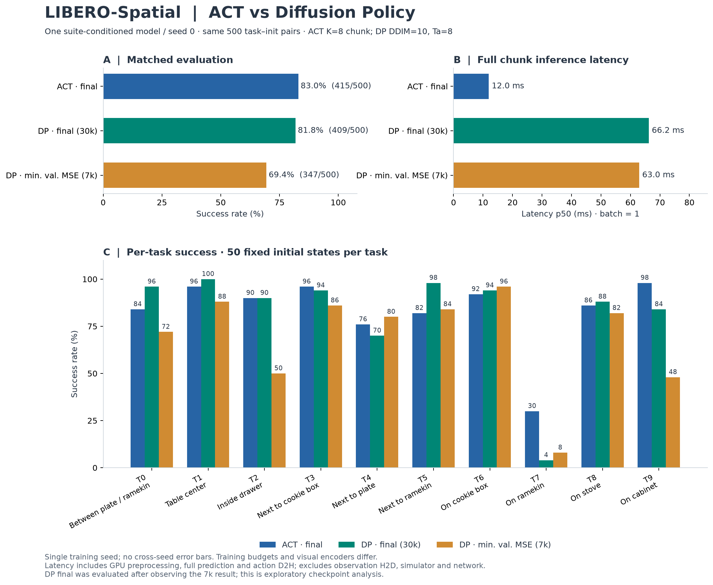
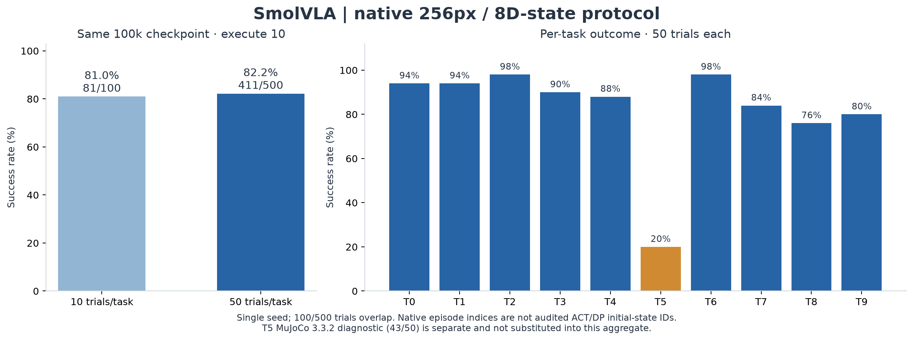
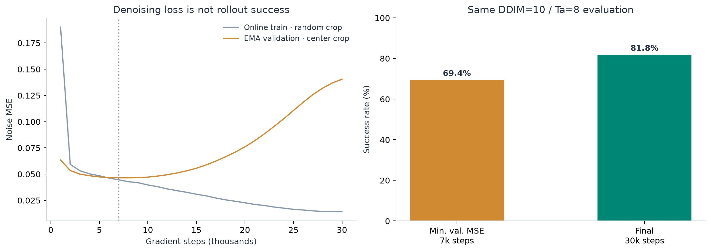
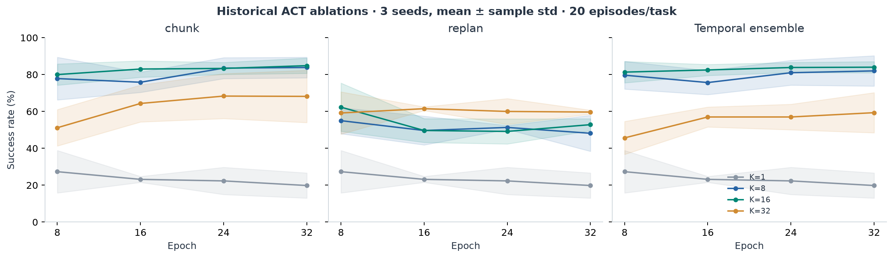

# RoboScope

**Reproducible visuomotor learning, from demonstrations to closed-loop evaluation.**

[中文](README.zh-CN.md) · [Quick start](docs/quickstart.md) · [Architecture](docs/architecture.md) · [Experiments](docs/experiments.md) · [Research findings](docs/findings.md) · [Reproduction](docs/reproducibility.md)

RoboScope trains and evaluates **ACT, Diffusion Policy, SmolVLA and Pi-0 LoRA on LIBERO-Spatial**, with per-episode records, explicit experiment configurations and reproducible training/evaluation figures.



## Official closed-loop results (2026-09-28)

SR = successful episodes / evaluated episodes. Each cell shows SR and successes out of 50 trials; each policy has 500 trials total and training seed 0. Each task picks up the black bowl at the named location and places it on the plate. Rows are the same LIBERO-Spatial task, matched by name. ACT and DP use their HDF5 task order; SmolVLA uses the native benchmark order, where “on the ramekin” is task 5 rather than task 7. Pi-0 uses the same names as ACT and DP.

| Task | ACT | DP | SmolVLA | Pi-0 LoRA |
|---|---:|---:|---:|---:|
| Between plate and ramekin | 84% (42/50) | 96% (48/50) | 94% (47/50) | 100% (50/50) |
| Table center | 96% (48/50) | 100% (50/50) | 98% (49/50) | 98% (49/50) |
| Top drawer | 90% (45/50) | 90% (45/50) | 88% (44/50) | 92% (46/50) |
| Next to cookie box | 96% (48/50) | 94% (47/50) | 98% (49/50) | 94% (47/50) |
| Next to plate | 76% (38/50) | 70% (35/50) | 76% (38/50) | 74% (37/50) |
| Next to ramekin | 82% (41/50) | 98% (49/50) | 94% (47/50) | 84% (42/50) |
| On cookie box | 92% (46/50) | 94% (47/50) | 90% (45/50) | 90% (45/50) |
| On the ramekin | 68% (34/50) | 74% (37/50) | 94% (47/50) | 84% (42/50) |
| On the stove | 86% (43/50) | 88% (44/50) | 84% (42/50) | 76% (38/50) |
| On the wooden cabinet | 98% (49/50) | 84% (42/50) | 80% (40/50) | 84% (42/50) |
| **Suite** | **434/500 (86.8%)** | **444/500 (88.8%)** | **448/500 (89.6%)** | **438/500 (87.6%)** |

ACT is K=8 chunk execution at epoch 32. DP is the 30k final checkpoint, DDIM=10, Ta=8. SmolVLA is the 100k official Spatial checkpoint, executing 10 of 50 predicted actions. Pi-0 is the 30k HF Spatial LoRA checkpoint, executing 8 actions, on MuJoCo 3.3.2 for every task.

The “on the ramekin” row is the MuJoCo 3.3.2 re-evaluation on PRO 5000s for ACT, DP, and SmolVLA. Their other nine tasks stay on the earlier published runs. Pi-0’s whole table is the new MuJoCo 3.3.2, 256px, 8D-state evaluation. Image size, proprioception, and rollout budget still differ, the table is the official result after merging the corrected reruns, with each policy retaining its own evaluation protocol. [Official provenance and checkpoint identities](results/official_spatial/summary.json) · [Rerun configurations](results/mujoco332/protocol.json).

## Experiment progress

All four training runs and their 50-trial-per-task evaluations are complete: ACT K8 at epoch 32 (56,064 updates), DP final EMA at 30k updates, native SmolVLA at 100k, and HF Spatial Pi-0 LoRA at 30k. The corrected on-ramekin reruns change ACT from 30% to 68%, DP from 4% to 74%, and SmolVLA from 20% to 94%; these are included above. Pi-0 LoRA scores 84% on that task.

Training recipes: [ACT](configs/libero_spatial/act_baseline.json) · [DP](configs/libero_spatial/diffusion.json) · [SmolVLA](configs/libero_spatial/smolvla_official.json) · [Pi-0 LoRA](configs/libero_spatial/pi0_lora_hf_spatial.json). See the [evaluation report](docs/evaluation_20260926.md) for the rerun protocols and merge accounting.

## Results that changed our interpretation

The original matched ACT/DP study, before the ramekin re-evaluation above:

| Policy | Checkpoint | Success / 500 | SR | Inference p50 |
|---|---|---:|---:|---:|
| ACT, K=8, chunk execution | Epoch 32 | 415 | **83.0%** | 12.0 ms |
| DP, DDIM=10, Ta=8 | Final, 30k updates | 409 | **81.8%** | 66.2 ms |
| DP, DDIM=10, Ta=8 | Minimum validation noise MSE, 7k | 347 | 69.4% | 63.0 ms |

Same seed 0, ten tasks, 50 fixed initial states per task, two RGB cameras, 7D OSC_POSE actions, and rollout budget. Visual encoders, observation history, normalization and training budgets differ: **this is a policy-recipe comparison, not an architecture-only ablation**. Latency is batch-1 full prediction, including preprocessing and action D2H, excluding input H2D, simulation and network.

**Checkpoint selection changed DP success by +12.4 percentage points without retraining.** Validation denoising loss increased while closed-loop performance improved. DP final is only 1.2 points below ACT; one training seed does not establish a stable ranking. Final was evaluated after inspecting the earlier result, so checkpoint analysis is exploratory. [Full analysis and paired uncertainty](docs/findings.md).

## What is implemented

- **Policies:** task-ID-conditioned ACT and CNN / Conditional 1D U-Net Diffusion Policy, using LeRobot model components.
- **Data:** trajectory-level train/validation split, explicit image convention, train-only normalization, frame and temporal-window datasets, memory-mapped image cache and CUDA prefetch.
- **Execution:** chunk execution, per-step replanning, ACT temporal ensemble; independent state per episode. Parallel simulators with synchronous policy inference.
- **Experiments:** 12 ACT models (four chunk sizes × three seeds), checkpoint curves, DP sampler/execution-horizon ablations, best-versus-final analysis.
- **Evidence:** 3,500 portable episode records for the ACT–DP study, checkpoint hashes, task/init identities, training history, and CPU-only figure regeneration. Historical ACT curves retain their separate three-seed / 20-episode protocol.
- **Runtime:** two RTX 4090s selected by UUID, matched to EGL via PCI address; isolated output directories and source snapshots.

**SmolVLA, official Spatial protocol:** paper architecture on the released 256×256 dataset, 8D end-effector state, 100k updates, seed 0. Executing 10 of 50 predicted actions scores **448/500 (89.6%)** after replacing the “on the ramekin” task with the MuJoCo 3.3.2 re-evaluation (47/50; the earlier run of that task was 10/50). In-training rollouts replan every step and are a different number (68–73% on 100 episodes). Recipe: [smolvla_official.json](configs/libero_spatial/smolvla_official.json). Per-task scores are in the table above.

**Pi-0 LoRA, HF Spatial:** 30k updates, seed 0, evaluated for 50 trials on every task under MuJoCo 3.3.2. Closed-loop success is **438/500 (87.6%)**. The training curve is below. Recipe: [pi0_lora_hf_spatial.json](configs/libero_spatial/pi0_lora_hf_spatial.json). The older HDF5 [Pi-0 runbook](docs/pi0_lora_spatial.md) is a separate path and is not the score in the table.



## SmolVLA + RL Token post-training

RLT starts from the official 100k SmolVLA Spatial checkpoint, freezes the VLA and a learned 960D RL token, then trains a Gaussian actor and twin Q critics. The progress-reward run adds a small potential-based signal for reaching, securely grasping, and transporting the target bowl; privileged contact and geometry information is used only to calculate reward. RLT and its SFT control both execute 10 actions per policy call.

| LIBERO-Spatial task (native HF order) | SFT, C=10 | Sparse-reward RLT, C=10 | Progress-reward RLT, C=10 |
|---|---:|---:|---:|
| Between plate and ramekin | 48/50 (96%) | 46/50 (92%) | 48/50 (96%) |
| Next to ramekin | 46/50 (92%) | 49/50 (98%) | 47/50 (94%) |
| Table center | 49/50 (98%) | 47/50 (94%) | 49/50 (98%) |
| On cookie box | 44/50 (88%) | 47/50 (94%) | 49/50 (98%) |
| Top drawer | 41/50 (82%) | 42/50 (84%) | 45/50 (90%) |
| On the ramekin | 42/50 (84%) | 43/50 (86%) | 44/50 (88%) |
| Next to cookie box | 50/50 (100%) | 45/50 (90%) | 50/50 (100%) |
| On the stove | 41/50 (82%) | 46/50 (92%) | 45/50 (90%) |
| Next to plate | 39/50 (78%) | 34/50 (68%) | 46/50 (92%) |
| On the wooden cabinet | 42/50 (84%) | 38/50 (76%) | 39/50 (78%) |
| **Suite** | **442/500 (88.4%)** | **437/500 (87.4%)** | **462/500 (92.4%)** |

The progress-reward policy is **4.0 percentage points above its matched SFT control** and **5.0 points above sparse-reward RLT** in this single-seed evaluation. The run collected 100,044 environment steps over 774 training episodes and made 237,155 learner updates; these rollout totals are training data, not the 500-episode evaluation above. All three conditions use 50 fixed initial states per task. Task 4 (top drawer) was rerun for all three after correcting the hf-libero reset protocol, with matching physical initial-state fingerprints; other tasks reuse their archived evaluations. This is a descriptive single-seed result and does not establish cross-seed robustness. [Compact per-task results, protocol, and checkpoint hashes](results/rlt_hf_spatial/summary.json) · [Progress-reward recipe](configs/libero_spatial/smolvla_rlt_hf_progress.json) · [HF input/environment contract](docs/smolvla_rlt_hf.md) · [Reward definition and validation](docs/smolvla_rlt_progress_reward.md).

The default RLT recipe uses native HF Spatial weights and processors, 256px RGB, 8D EEF state, hf-libero 0.1.4 and MuJoCo 3.3.2. The old HDF5 SmolVLA recipe remains available for reproducing its historical path ([details](docs/smolvla_spatial.md)). Run RLT by stages with `--stage token`, `--stage warmup`, `--stage online`, and `--stage evaluate`; see the [step-by-step commands](docs/smolvla_rlt_spatial.md#按阶段执行).

## SmolVLA + PPO post-training in RLinf

The SmolVLA adapter on the local RLinf `codex/smolvla-ppo` branch completed 100 PPO rollout/update iterations from the same official Spatial SFT 100k checkpoint. This is a separate experiment from the four-policy official table above and from RLT. In a 500-episode LIBERO-Spatial BF16 evaluation (50 fixed initial states per task, MuJoCo 3.3.2, ODE10, execute 10 of 50 actions), PPO100 succeeded in **449/500 (89.8%)** versus **442/500 (88.4%)** for the historical SFT control. The observed gain is **7 episodes (+1.4 percentage points)** in one training seed; the progress-reward RLT reference is **462/500 (92.4%)**. On top-drawer task 4, PPO100 was **43/50**, historical SFT **41/50**, and a same-BF16-runtime SFT check **42/50**.

The 50-episode evaluation during training ended at **40/50**, equal to its same-protocol SFT baseline; it is a different, smaller evaluation from the 500-episode fixed-initial-state test. PPO trained with a single sampled Gaussian flow transition per action chunk, and the final evaluation used the deterministic ODE solver after its Gaussian initial latent. Full protocol, parameters, runtime caveats and reproduction instructions: [PPO experiment](docs/smolvla_ppo_spatial.md). Portable [per-episode records and summary](results/smolvla_ppo_spatial/summary.json) and [Spatial RLinf override](configs/rlinf/smolvla_ppo_spatial.yaml) are included. Model weights, raw traces and benchmark assets are not bundled.

**Not implemented in RoboScope itself:** PPO training, asynchronous/RTC inference, and ManiSkill/RoboCasa. The PPO adapter lives in RLinf; these other directions remain [planned extensions](docs/roadmap.md).

## Reproduce the figures first

```bash
python -m pip install -e '.[report,test]'
python scripts/export_official_results.py
python -m roboscope report --study all
python -m pytest tests/test_results.py tests/test_native_results.py tests/test_followup_results.py tests/test_official_results.py tests/test_cli.py
```

This path needs no GPU, simulator, datasets, or checkpoint download. The official comparison is derived from [per-task records](results/official_spatial/per_task.csv) and their audited episode sources. ACT/DP figures are rebuilt from [audited CSV records](results/libero_spatial/episodes.csv). VLA figures are rebuilt from [results/vla_spatial/snapshot.json](results/vla_spatial/snapshot.json). Success rates are checked against the episode records. PNG, PDF and SVG outputs are generated under `docs/assets/`.

For training and rollout evaluation, follow the [tested environment and data setup](docs/quickstart.md). Training/evaluation commands preview the plan unless `--start` is supplied. Historical ACT/DP runs used two RTX 4090s; corrected reruns and the Pi-0 evaluation used RTX PRO 5000, PyTorch 2.7.1+cu128 and MuJoCo 3.3.2.

## Code map

```text
src/roboscope/
  data/          # LIBERO HDF5 adapter, HF/LeRobot adapters, normalization, caches
  policies/      # ACT, Diffusion Policy, Pi-0 LoRA, SmolVLA, RLT actor
  envs/          # LIBERO setup, observation adapter, spawned environment pool
  trainers/      # behavior cloning, diffusion, official SmolVLA, Pi-0, RLT
  evaluation/    # matched ACT–DP protocol and HF Pi-0 closed-loop adapter
  runtime/       # GPU/EGL binding, checkpoint/RNG utilities, worker supervision
  workflows/     # one entry per recipe family; no shared loss formulas
  reporting/     # episode audits, official task alignment, training/evaluation plots
configs/         # path-independent scientific recipes
examples/        # complete command sequences
results/         # official comparison, historical evidence, and corrected reruns
scripts/         # export, train entrypoints, release allowlist
```

Structure is inspired by [verl-vla](https://github.com/verl-project/verl-vla)'s separation of workflows, training, and integrations. RoboScope does **not** depend on verl or claim its distributed/RL capabilities.

## Research gallery

Historical results before the on-ramekin correction:









[DP inference ablations on the 7k checkpoint](docs/assets/dp_best_ablations.png) · [Protocol and configuration matrix](docs/experiments.md)

## Reproduction status

Historical ACT/DP metrics come from the archived experiment implementation. Corrected on-ramekin reruns and the complete Pi-0 LoRA evaluation have their own versioned records and configurations. The official table derives its task selection from those sources. The validation record distinguishes code checks from full rollout evaluations. See [validation](docs/validation.md) and [migration](docs/migration.md).

## Contributing and attribution

[Contributing](CONTRIBUTING.md) · [GitHub release guide](docs/github_release.md) · [Third-party notices](THIRD_PARTY_NOTICES.md) · [Apache-2.0 license](LICENSE)

Built on [LeRobot](https://github.com/huggingface/lerobot), [LIBERO](https://github.com/Lifelong-Robot-Learning/LIBERO), [ACT](https://github.com/tonyzhaozh/act), and [Diffusion Policy](https://github.com/real-stanford/diffusion_policy). Please cite the original methods and benchmark when using this project. Project software version: **0.1.0**.
