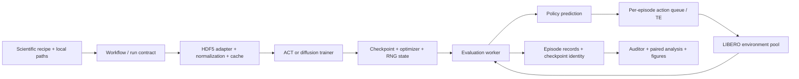

# Architecture and extension boundaries

This layout follows the responsibility separation of [verl-vla](https://github.com/verl-project/verl-vla), not its distributed implementation. There is no Ray/verl dependency and no pretend RL backend.

| Module | Owns | Does not own |
|---|---|---|
| `data` | split, indexing, statistics, sequence alignment, cached pixels | simulator reset or checkpoint selection |
| `policies` | ACT / DP forward, conditioning, normalization and prediction | task scheduling or simulator handles |
| `envs` | observation conversion, fixed init, action application, success predicate | learned policy weights |
| `trainers` | losses, optimizers, schedules, EMA and checkpoints | GPU selection |
| `evaluation` | histories, execution schedule, model calls and episode records | training updates |
| `runtime` | UUID/EGL mapping, process supervision | model math |
| `workflows` | configuration, provenance, process composition | loss formulas |
| `reporting` | integrity checks, aggregation, figures | CUDA or simulator execution |

## Current tensor contract

- Raw images: two RGB cameras, `uint8`, CHW; ACT batch `[B,3,128,128]`, DP `[B,2,3,128,128]`.
- State: `[B,9]` or `[B,2,9]`: 7 joint positions and 2 gripper qpos.
- Task condition: integer `task_id`, `[B]`, learned embedding. No object ground-truth pose in policy inputs.
- Action: unnormalized controller command `[B,K,7]`. First six values are OSC delta commands, last value is gripper command. Clip to controller bounds at execution.
- Episode reset clears history, action queue and TE state. DP gets a dedicated random generator per task/init episode.
- `eef_pos` is recorded for analysis only; it is not passed to either policy.

## Adding a policy

Implement prediction in `policies`, a compatible observation adapter, a trainer in `trainers`, and explicit checkpoint loading in `evaluation`. Register the new route in the CLI/workflow only after end-to-end tests exist. Preserve action units in a versioned adapter rather than assuming every model emits OSC deltas. Model-specific checkpoint formats and normalization statistics must travel together.

The current ACT and DP routes are explicit, not a large plugin framework. This keeps algorithm-dependent operations visible. A generalized registry should be introduced when a third implemented policy demonstrates which parts are actually shared.

## π-series and RL implications

A π adapter needs language/tokenization, camera and proprioception mapping, action-unit conversion, and inference chunk metadata. A frozen task-ID embedding is not a substitute for language conditioning.

RL requires additional trajectory fields: reward, terminated/truncated, policy version, action/log-probability semantics, and possibly value estimates. ACT/DP chunk generation cannot be dropped into PPO as if it were a one-step Gaussian actor. Decide between a policy-native objective, residual actor, or another validated post-training method, and record behavior-policy identity before sharing this rollout layer.

Simulator vectorization is not multi-GPU DDP or asynchronous control. These capabilities have separate interfaces and validation requirements.
